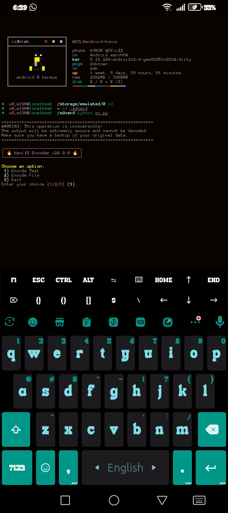
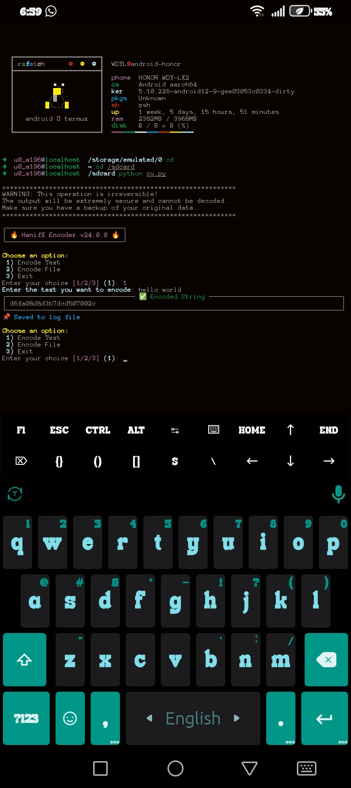
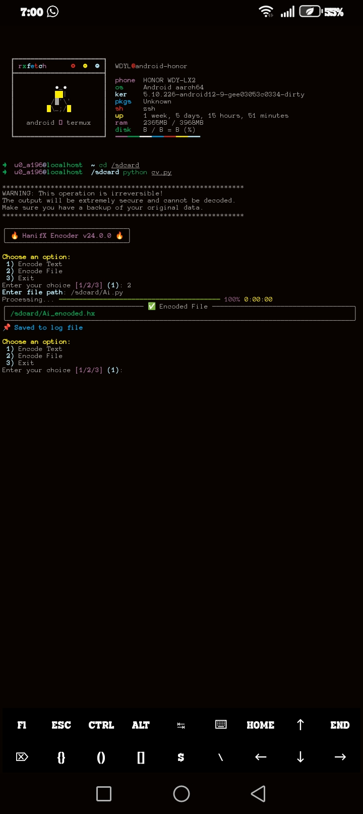

# hanifx-encode
HanifX: A custom Python encoding module for secure and unique data transformation.
# hanifx

**HanifX** is a custom Python encoding module for secure and unique data transformation.  
It provides an easy-to-use interface for encoding text, generating deterministic outputs, and integrating with Python projects, web APIs, or terminal applications.

---

## Features

- **Custom Encoding** – Completely unique algorithm (not standard hash or AES).  
- **Deterministic Output** – Same input always produces the same encoded output.  
- **Lightweight & Fast** – Minimal dependencies, works on Python 3.6+.  
- **Versatile Use** – Use in scripts, web apps, or terminal projects.  
- **Secure** – Encodes data in a non-standard way to provide uniqueness.

## License

This project is licensed under the MIT License. See the [LICENSE](LICENSE) file for details.
use --

## HanifX Encode – Demo Screenshots







---

## Installation

You can install HanifX via PyPI:

```bash
pip install hanifx


